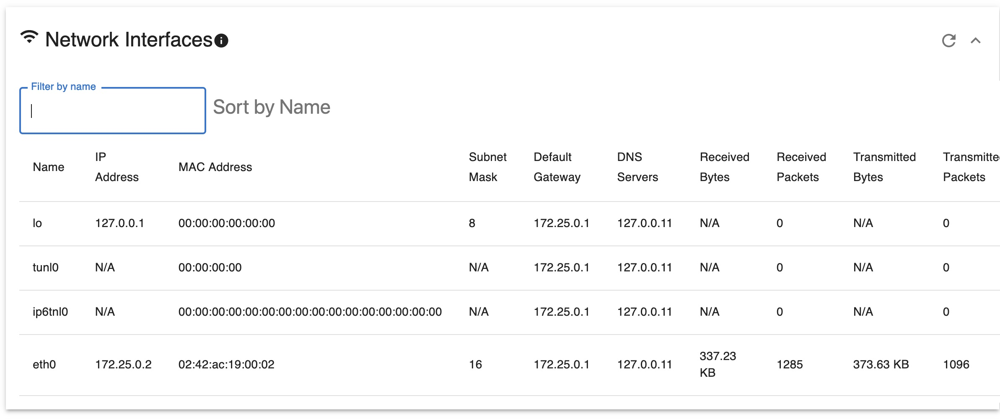

# Linux Dashboard

This dashboard, crafted with React and Node.js, was developed as an educational endeavor to better understand and display Linux system metrics. While its primary purpose is for learning, it offers a streamlined view of Linux system data for those interested in monitoring their setups.

## Prerequisites

- Docker
- Docker Compose

## Quick Start

1. **Clone the Repository**

   ```bash
   git clone https://github.com/nikokarvinen/linuxdashboard.git
   ```

   Navigate to the project directory:

   ```bash
   cd linuxdashboard
   ```

2. **Build and Run Containers**

   Use Docker Compose to build and run both the frontend and backend containers.

   ```bash
   docker-compose up --build
   ```

   This command will build the Docker images if they don't exist and then start the containers.

3. **Access the Application**

   - Frontend will be available at `http://localhost:3000`

## Features

- CPU Utilization
- Network Interfaces
- Running Processes
- Disk usage
- Memory info
- System Uptime
- More to come...

## Screenshots

Cpu Info


Network Interfaces


Processes


Disk Info


Memory Info And System Uptime


Overwiev

